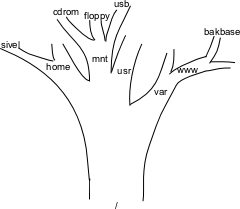

## Conceptos básicos {#conceptos_basicos}

Los conceptos y herramientas presentados desde esta sección se asimilan mejor 
practicando. 
Procure ejecirtarlos desde un interprete de ordenes (bien operando 
directamente un sistema tipo Unix o bien ingresando remotamente desde otro 
sistema como se explicó, (ver [xref](#primer_uso_de_adJ)).

### Definiciones iniciales {#definiciones_iniciales}

Un *archivo* es información delimitada y con atributos que ayudan a 
identificarla como nombre, fecha de creación y ubicación. Se ubica en alguna 
ruta o sitio del sistema de archivos.

Un *programa* es un archivo con instrucciones que pueden ser efectuadas 
por el computador.  La secuencia de instrucciones determina lo que hará el 
programa.  El *formato de un archivo* es la manera como está organizada la 
información para que pueda ser empleada con facilidad por el programa con el 
que fue creado.  Por ejemplo un archivo de nombre ```carta.odt``` posiblemente 
se trate de una carta escrita en formato de Open Document Format 
(lo sugieren las últimas letras ```.odt```). 
Para verla debe usarse un programa que entienda ese formato, uno entre otros 
es LibreOffice.

### Intérprete de ordenes {#interprete_de_ordenes}

El intérprete de ordenes le permite usar varias ordenes internos, así 
como ejecutar programas. 
Es común que las ordenes o programas requieran algo de información como 
suministro (i.e parámetros o argumentos), así como opciones que modifiquen 
el comportamiento por defecto. 
Tal información suele darse a continuación del nombre de la orden, separando 
un dato o una opción de otra con espacios. Si es una de las primeras veces 
que ingresa al sistema, recomendamos los siguientes ordenes/programas:

**man man**

:   El programa **man** permite ver un tema del manual del sistema. Puede 
recibir como parámetro el tema sobre el cual desea ver la documentación. 
Así que **man man** presenta la documentación de la orden **man**. 
Entre los temas posibles puede emplear el nombre de un programa instalado o 
de una función de la librería del sistema.  

**passwd**

: Permite cambiar su clave en el sistema. Por favor escoja una buena clave 
que no aparezca en diccionario de idioma alguno, preferiblemente que tenga 
mayúsculas y minúsculas, así como números y/o caracteres de puntuación. 
Sugerimos las claves generadas con programas especializados como **apg**. 
Tenga en cuenta que si su clave llega a ser descubierta por un tercero, 
él/ella podría actuar a nombre suyo.

**apg**
Creador de contraseñas seguras

**chfn**

: Le permite cambiar datos personales y el intérprete de ordenes que desea 
por defecto (sugerimos /**bin/ksh**)

### Sistema de Archivos

En Unix la información se organiza en archivos dentro de directorios del 
sistema de archivos.  El directorio inicial o raíz se denota por ```/```, los 
nombres de archivos o directorios pueden especificarse indicando la ruta 
completa desde la raíz, por ejemplo el archivo ```/usr/bin/awk``` está en el 
directorio de nombre bin que a su vez está en un directorio de nombre 
```usr``` el cual es un subdirectorio del directorio raíz ```/```. 
Cada usuario del sistema tiene además de su login y clave, un directorio que 
llamamos *directorio personal* cuya ruta normalmente es de la forma 
```/home/juan```.



El intérprete de ordenes que emplee tendrá como parte de su estado un 
directorio de trabajo, un símbolo de espera de ordenes y variables de entorno. 
La manera de ver y alterar estos datos depende del intérprete de ordenes que 
emplee, nos limitaremos al intérprete de ordenes **ksh** (que tiene bastantes 
cosas en común con otros intérpretes de ordenes como **bash**).

Podrá examinar el directorio de trabajo con ```pwd```, listar algunas variables 
de ambiente (las exportadas) con **export** y modificar el símbolo de espera 
de ordenes con la variable de ambiente ```PS1```.
A continuación se listan algunas ordenes/programas relacionados con el 
sistema de archivos y un mínimo del uso de cada uno. Sugerimos que mire la 
documentación que corresponde a cada uno (e.g para ver documentación del 
programa **ls** ejecute desde un intérprete de ordenes **man ls**):

```pwd```

: Muestra directorio de trabajo.

```ls```

: Muestra listado de archivos y directorios. Sin parámetros muestra los del 
directorio de trabajo. Como parámetro puede indicarse la ruta del directorio 
del cual se desea ver el contenido y con la opción ```-l``` presenta atributos 
adicionales de cada archivo.

```mkdir public_html```

: Permite crear un directorio (en este caso ```public_html```), si no se 
especifica la ruta completa **mkdir** lo crea en el directorio de trabajo.

```cd public_html```

: Para cambiarse a otro directorio (en este caso al directorio ```public_html```
que es subdirectorio del directorio de trabajo). Sin parámetros, ```cd```
cambia al directorio personal.

```cp traido/index.htm public_html/index.html```
: El programa ```cp``` permite copiar uno o más archivos. En el ejemplo 
presentado el archivo ```index.htm``` del subdirectorio traido es copiado 
en el subdirectorio public_html con el nombre index.html. Note que ambos 
subdirectorios son subdirectorios del directorio  de trabajo y que debe 
existir el archivo ```traido/index.htm```. Pueden copiarse también directorios  
junto con subdirectorios usando la opción ```-r```, por ejemplo:
```
    cp -r traido/* public_html/
```
que copia todos los archivos y subdirectorios del directorio traido de manera recursiva al 
directorio ```public_html```.

```rm traido/index.htm```

: Que elimina el archivo ```traido/index.html```. Pueden eliminarse 
directorios con todo su contenido de forma recursiva con la opción 
```-rf``` del programa ```rm```.

```mv traido/juan.htm traido/pedro.html```

: El programa ```mv``` moverá (o en este caso renombra) el archivo 
```traido/juan.htm a traido/pedro.html```.

### Lecturas recomendadas

Páginas ```man``` de las 11 ordenes /programas introducidos en este capítulo.
Se han tomado porciones de la sección "telnet y ssh" de [AALinux](#bibliografia)


 

 
