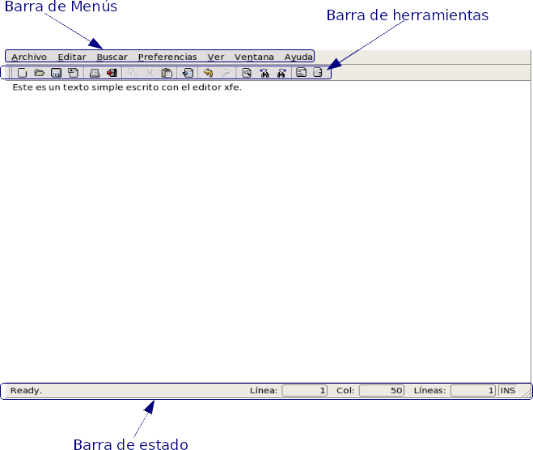
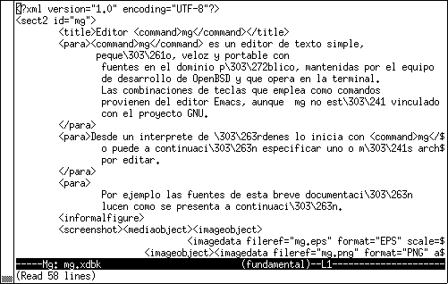
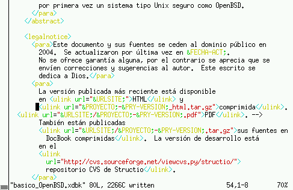

## Edicion de textos {#edicion_de_textos}

Un editor de texto le permite redactar textos simples y guardarlos en un formato
simple (o plano).

A medida que administre su sistema adJ, notará que es más y más necesaria la 
labor de editar textos. La primera vez posiblemente querrá usar el editor más 
gráfico y sencillo: ```xfw```. Pero si no tiene un entorno gráfica puede 
emplear ```mg```, y si desea eficiencia posiblemente le servirá ```vim```.

### Editor xfw {#editor_xfw}

**xfw** es un editor de texto simple para el sistema X-Window, es decir opera 
en modo gráfico. Viene incluido con el administrador de archivos 
xfe (ver [xref](#administrador_de_archivos_xfe)) desarrollado por Roland Baudin.

Se inicia desde el menú de fluxbox (botón derecho sobre el escritorio), desde 
Oficina->xfw o bien desde un interprete de ordenes con
```
xfw
```
o si por ejemplo desea abrir el archivo carta.txt que está en el directorio 
actual:
```
xfw carta.txt
```
	
Como se presenta en la figura es una aplicación gráfica típica con una barra 
de menús, una barra de herramientas, una barra de estado y por supuesto el 
área para escribir textos que tendrá un cursor que indica la siguiente 
posición donde escribirá cuando presione una tecla. En la barra de estado se 
índica el número de línea y el número de columna en la que está el cursor 
para ingresar textos. Así mismo el número total de líneas del texto que está 
editando y el estado de inserción (INS) o sobreescritura (OVR) que puede 
cambiar con la tecla **INS** o marcando en el menú Preferencias->Sobreescribir.



### Editor emacs {#editor_emacs}

**emacs** es un editor de texto muy poderoso perteneciente al grupo GNU, una de 
sus grandes caracteristicas es el reconocimiento de formatos entre ellos muchos
lenguajes de progrmacion.Por otro lado otra de sus caracteristicas es su facilidad
de configuracion y personalizacion, lo cual permite crear nuevos mandos y asignar 
combinaciones de teclas.

Algunos de sus comandos son:
C-x C-f : apertura de un archivo
C-x C-c : salimos de emacs
C-x C-s : guardamos el archivo
C-x 2 : dividimos la pantalla en dos en horizontal
C-x 3 : dividimos la pantalla en vertical
C-x o : nos movemos entre las pantallas
C-v : desplazarnos "1 página" hacia delante

### Editor mg {#editor_mg}

**mg** es un editor de texto simple, pequeño, veloz y portable con fuentes 
en el dominio público, mantenidas por el equipo de desarrollo de OpenBSD 
y que opera en la terminal. Las combinaciones de teclas que emplea como 
ordenes provienen del editor Emacs, aunque mg no está vinculado con el 
proyecto GNU.

Desde un interprete de órdenes lo inicia con **mg** o puede a continuación 
especificar uno o más archivos por editar.

Por ejemplo las fuentes de esta breve documentación lucen como se presenta 
a continuación.



Notara que mg no soporta UTF-8, así que su propósito es hacer breves 
ediciones a archivos de configuración cuando no puede usar ```xfw``` o 
por ejemplo ```vim```.

Notará que los caracteres que digite estando en mg serán introducidos en el 
buffer que esté operando, y que podrá usar las flechas para desplazarse. 
Las ordenes más típicos se dan combinando la tecla Control simultaneamente 
con una y después con otra tecla. Por ejemplo para guardar use 
**Control x** y después **Control s**. Esto suele denotarse en la documentación 
de mg con: **C-x C-s**

Por ejemplo para cambiar la IP de una tarjeta de red con dispositivo re0 
usaría:
```
mg /etc/hostname.re0
```
		
Alli podría ingresar por ejemplo
```
inet 192.168.1.1 255.255.255.0 NONE
```
		
Guardar con **C-x C-s** y salir con **C-x C-c**.

### Editor vi {#editor_vi}

**vi** es un clásico editor en ambientes tipo UNIX cuya prioridad es la 
eficiencia. Por lo mismo no requiere el uso de ratón sino de breves ordenes 
que a medida que se memoricen y usen harán más rápida la edición de textos.

Para editar un archivo (digamos ```ma.txt```) con el editor vi, teclee desde 
un intérprete de ordenes:
```
$ vi ma.txt
```

#### Modos de vi {#modos_de_vi}

##### Modo ordenes {#modo_ordenes}

Cuando **vi** cargue, se observará en la pantalla una parte del archivo de 
texto que va a editar. Al arrancar **vi**, está en un modo especial llamado 
**modo ordenes** ó **modo normal** . Esto significa, por ejemplo, que si 
presiona **l** en el teclado, en vez de introducir una **l** en la posición 
actual del cursor, el cursor se va a mover un caracter a la derecha. En este 
modo, los caracteres del teclado sirven para enviar ordenes a **vi**.

##### Ordenes de movimiento - Movimientos del cursor {#ordenes_movimiento}

Para mover el cursor, pulse las teclas: **h** (mueve a la izquierda), 
**j** (mueve hacia abajo), **k** (mueve hacia arriba), **l** 
(mueve a la derecha).

Las teclas **h**, **j**, **k** y **l** son prácticas porque una vez 
acostumbrado a ellas, será capaz de moverse por el archivo sin tener que 
retirar los dedos de la posición natural del teclado.

##### Modo inserción {#modo_insercion}

Este modo es para introducir texto, es decir lo que vaya tecleando podrá 
verlo en la pantalla, en el lugar donde estaba el cursor. Veamos algunas 
utilidades para este modo:

Puede insertar texto con varias teclas:

**i**
: Inserta texto antes del caracter sobre el cual está el cursor.

**a**
: Inserta texto después del caracter sobre el cual está el cursor.

**I**
: Inserta texto al comienzo de la línea en la que está el cursor.

**A**
: Inserta texto al final de la línea en la que está el cursor.

**o**
: Abre espacio para una nueva línea después de la línea en la que está el 
	cursor y permite insertar texto en la nueva línea.

**O**
: Análogo al anterior, pero abre espacio en la línea anterior.


##### Edición de texto - Borrar {#edicion_de_texto_borrar}

Debemos estar en **modo ordenes**. Pulsar **ESC** para pasar de 
**modo inserción** a **modo ordenes**.

Mover el cursor y colocarlo sobre el caracter que va ser borrado y pulsar **x**.

Digitar **dw** para borrar hasta el final de la palabra. Y digitando **dd** 
se borra la línea entera.

##### Deshacer cambios {#deshacer_cambios}

Si por alguna razón desea deshacer los cambios realizados en el texto, estando 
en modo normal,	pulse **u** para deshacer el último cambio. Con **U** se 
deshace todos los cambios realizados en la línea actual.

#### Otras ordenes - Guardar y salir {#otras_ordenes_guardar_y_salir}

Pulse la tecla **ESC** (para asegurarse de que está en modo normal).

Escriba **:q!** y ejecute **ENTER** para salir de vi sin guardar ningún cambio 
que se haya hecho.

Para guardar los cambios realizados y salir, escriba **:wq** y ejecute 
**ENTER**.

Para guardar los cambios realizados sin salir de **vi** y seguir trabajando, 
escriba **:w** y ejecute **ENTER**.

Estando en el modo normal, pulsamos la orden **:** para pasar al 
**modo línea de ordenes** y el cursor se traslada a la última línea de la 
pantalla. Allí escribimos el nombre de la orden y pulsamos 
**RETORNO** para ejecutarlo.

 **Aviso** Recuerde: Para pasar de **modo inserción** a 
	**modo ordenes** pulsamos la tecla **ESC**. Puede desplazarse sobre el 
	archivo, empleando las flechas, PgUp, PgDn ó bien para mantener los 
	dedos mejor posicionados en el teclado puede emplear las teclas 
	**h**, **j**, **k** y **l**, como lo vimos anteriormente.

#### vim {#vim}

En su sistema puede haber diversas versiones de **vi**, recomendamos **vim** 
que ofrece extensa ayuda y cuenta con varias extensiones.

##### Modo visual - Copiar, cortar y pegar {#modo_visual_copiar_cortar_y_pegar}

En el **modo visual** "resaltamos" el texto para ser eliminado o copiado 
para luego pegarlo.

Asegúrese que esté en modo ordenes. Pulse **v** para entrar en modo visual. 
Mueva el cursor con las teclas de desplazamiento para resaltar o remarcar el 
texto a copiar.

Pulse **y** para copiar la sección remarcada. Si desea cortar digite **d**.

Ahora ubica el cursor en el lugar donde desea insertar el texto copiado o 
cortado **y** pulsa **p** para insertar el texto, después del cursor.

##### Otras características de vim {#otras_caracteristicas_de_vim}

Digrafos
: Útil para producir caracteres del español, si el teclado o la configuración 
	del mismo no lo permiten. Presione **Control-K** y después una 
	secuencia de dos teclas de acuerdo al caracter, e.g 'a produce á, 
	n? produce ñ, u: produce ü, !I produce ¡, ?I produce ¿. 
	Pueden verse otros caracteres con la orden:```digraphs```.

Resaltado de sintaxis
: Permite ver con colores que resaltan la sintaxis de algunos tipos de archivos 
	(por ejemplo fuentes de DocBook, C, LaTeX). Se activa con 
	```:syntax enable```. Para que se vean los colores de este editor, 
	asegúrese de que su variable de ambiente ```TERM``` tenga el valor de 
	una terminal que soporte color, por ejemplo las terminales gráficas 
	soportan ```xterm-color``` y desde consolas tipo texto por ejemplo 
	```VT220```. Vea como establecer la variable ```TERM``` en cada inicio 
	de sesión en [xref](#personalizacion).

Indentación automática
: Permite indentar automáticamente diversos tipos de archivos como XML, C, 
	LaTeX, XSLT. Se activa con ```:filetype indent on```. Para modificar 
	tal indentación pueden establecerse variables de **vim**, bien en la 
	sesión abierta, bien en ```~/.vimrc``` o bien en cada archivo. 
	Para fijar una configuración particular que se tome al editar cierto 
	archivo, basta agregar al comienzo una línea (puede ser un comentario 
	en el caso de lenguajes de programación) como:
```
/* vim: set expandtab tabstop=4 shiftwidth=4 foldmethod=marker: */
```
		
Numeración de líneas
: Pueden verse el número de cada línea con :**set number** y esta característica
	se deshabilita con ```:set nonumber```.

Archivo de configuración
: Cada usuario puede tener sus propias configuraciones en el archivo	
	```~/.vimrc```, que consta de líneas con ordenes o comentarios. 
	Las ordenes no deben iniciar con ':' y los comentarios se colocan en 
	líneas completas o al final de una línea iniciando con comillas. 
	Por ejemplo:
```
" Este es un ejemplo de archivo de configuración para vim
syntax enable
filetype on
filetype plugin on
filetype indent on
```
	Puede resultar instructivo que copie y examine un archivo de ejemplo 
	distribuido con **vim** así:
```
$ cp /usr/local/share/vim/vim63/vimrc_example.vim ~/.vimrc
```
		


##### Locale en vim {#locale_en_vim}

**vim** empleará el locale establecido en la variable de ambiente LANG 
(ver [xref](#locale)). Sin embargo si prefiere también puede establecer idioma 
de los mensajes que presenta, así como codificación de la terminal y de los 
archivos.

Puede establecer el idioma de los mensajes que vim presenta con la orden
 ```:language```, por ejemplo para establecer español de Colombia, desde el 
modo ordenes teclee: 
```
:language es_CO
```

Puede establecer esta configuración por defecto agregando la orden al 
archivo ```~/.vimrc```.

**vim** puede emplear codificaciones diferentes para la terminal y para los 
archivos, ambos se establecen con la variable ```encoding``` (o ```enc```) y 
cada uno en particular con ```termencoding``` (o ```tenc```) y 
```fileencoding``` (o ```fenc```). 
Los valores típicos para codificar español son latin1 (que corresponde a 
codificicación en un byte ISO8859-1) o utf8 (que corresponde a codificación 
multibyte UTF-8). Por ejmplo para establecer la codificación de la termina en 
UTF-8, desde modo ordenes teclee:
```
:set tenc=utf8
```

Típicamente **vim** detectará la codificación de los archivos que edite, o 
empleará su codificación preferida en archivos nuevos. Puede deshabilitarse 
la autodetección dejando vacía la variable ```fileencoding``` (lo cual no 
recomendamos). La forma recomendada y por defecto en vim es emplear una 
terminal que soporte la codificación especificada en LANG y dejar que vim la 
emplee y que autodetecte la codificación de archivos. Si no opera de esta 
forma puede intentar agregar a su archivo ```~/.vimrc```:
```
set encoding&           " terminal charset: follows current locale 
set fileencoding&       " auto-sensed charset of current buffer
```  
	
#### Lecturas recomendadas {#lecturas_recomendadas_edicion_de_textos}

Puede aprender sobre **vim** y su configuración en el manual de este programa 
que se consulta presionando la tecla ```F1```. 
Esta documentación también está disponible en Internet en: 
<http://vimdoc.sourceforge.net/htmldoc/usr_toc.html>

Hay numerosos archivos de ordenes (scripts) para **vim** en 
<http://www.vim.org/scripts/index.php>

