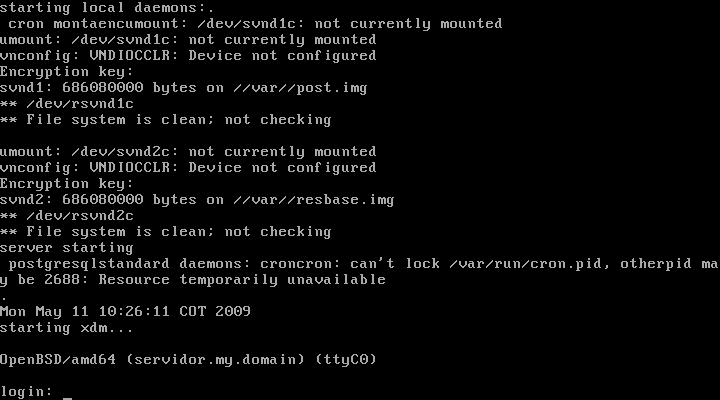
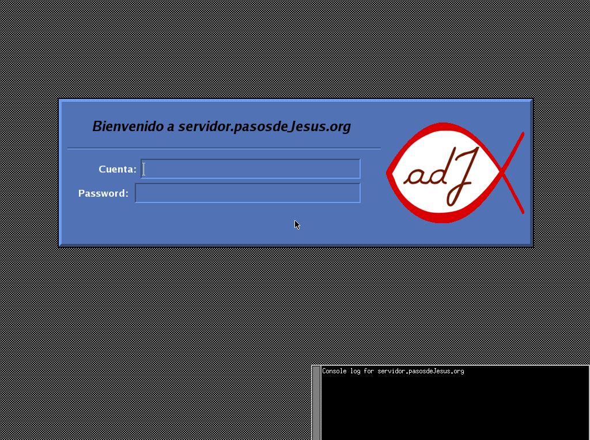
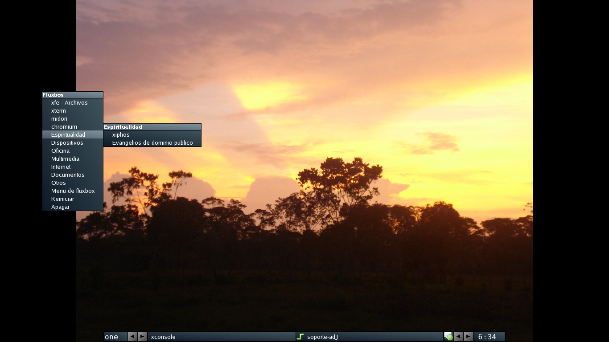
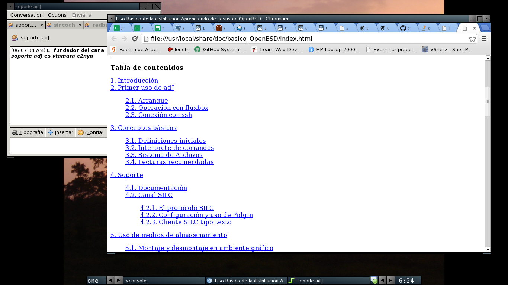
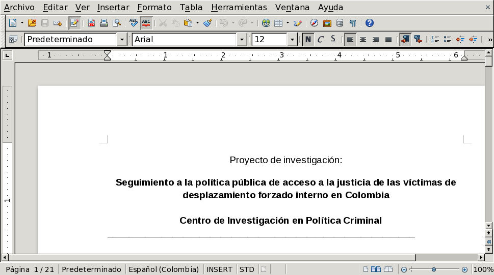
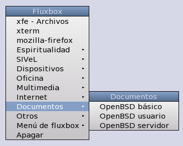
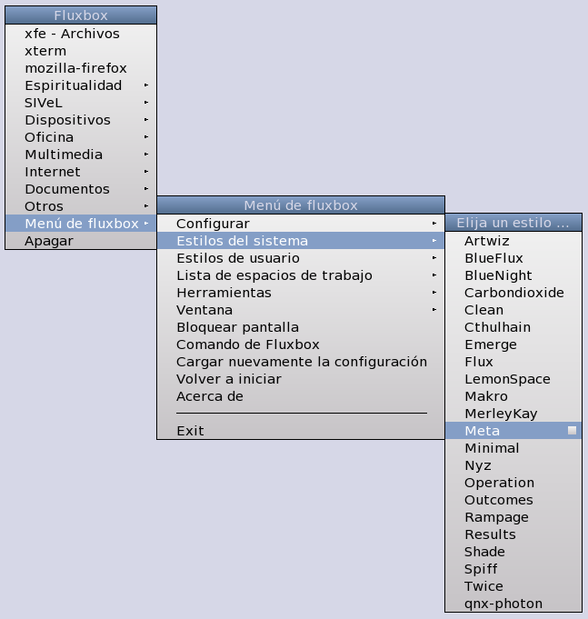
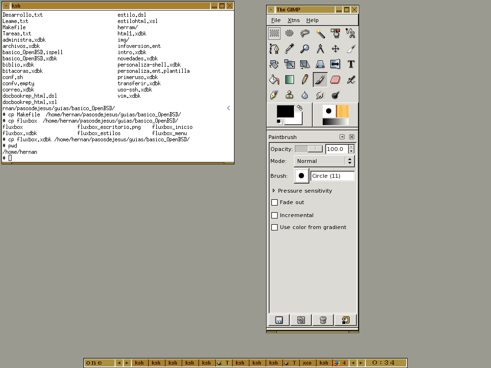
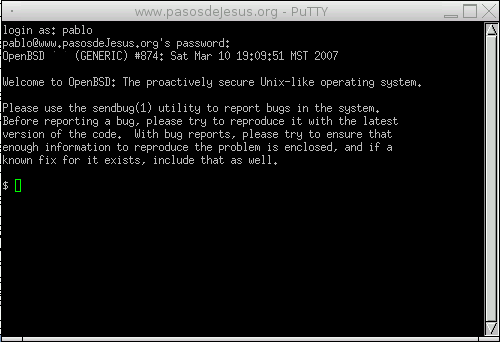

## Primer uso de adJ {#primer_uso_de_adJ}

Un servidor adJ puede operarse tanto directamente (sentado frente al computador 
donde se instaló y configuró), como remotamente por ejemplo con ```ssh```. 
En esta sección cubrimos ambos escenarios.

### Arranque   {#arranque}

Al iniciar un computador con adJ el núcleo de OpenBSD comenzará con una
interfaz de texto, detectará el hardware (se ven letras con fondo azul), 
iniciará los procesos básicos (se ven letras con fondo negro) 
y ejecutará los archivos de arranque. 

Típicamente la distribución adJ pide claves de imágenes cifradas[^primer.1] 
que se montan durante el arranque.

[^primer.1]: En las imagénes cifradas se almacena los archivos que el usuario quiera 
cifrar. Para poder guardar y recuperar los archivos se debe dar una clave 



Al dar la clave de cifrado correcta debe ver el mensaje 
 ```File system is clean``` o un chequeo de la imagen. 
En caso de dar una clave equivocada, continuará la secuencia de arranque 
pero no podrá acceder a los directorios cifrados[^primer.2].

[^primer.2]: Una vez en operación puede volver a dar estas claves ejecutando 
```
doas sh /etc/rc.local
```
desde un interprete de comandos, o desde el menú de 
Fluxbox Dispositivos->Reiniciar Servicios Faltantes


Después se iniciará un escritorio gráfico (X-Window[^primer.3]) y un aplicación 
(```xdm```[^primer.4]) que pide su usuario y su clave para iniciar una sesión:

[^primer.3]: X-Window es un sistema estandarizado para manejo de las aplicaciones 
gráficas en los sistemas operativos de la familia de los Unix

[^primer.4]: ```xdm```  es un gestor de pantalla que presenta al usuario con una 
pantalla de autenticación (*login*) que solicita el nombre de usuario y 
su contraseña



Si durante la instalación, no se instaló XWindow o no se ha configurado
para iniciar durante el arranque, lo que verá será una consola virtual tipo 
texto, como la del arranque.  
Por defecto hay 4 consolas virtuales tipo texto a las cuales pasa con las 
secuencias de teclas 
**Ctrl-Alt-F1, Ctrl-Alt-F2, Ctrl-Alt-F3 y Ctrl-Alt-F4**. 
La secuencia **Ctrl-Alt-F5** lo dejará en el entorno gráfico.

Las instrucciones para operación remota 
[(Conexión con ssh)](#conexion_con_ssh) le servirán para operar directamente 
en una consola virtual, una vez se autentique con su usuario y clave.

En entorno gráfico si se autentica correctamente se iniciará el administrador 
de ventanas ```fluxbox``` que se presenta brevemente en la siguiente sección.

 
### Operación con fluxbox {#operacion_con_fluxbox}

**Fluxbox** es un estético administrador de ventanas, muy liviano y por lo 
tanto veloz. Administra decoración de ventanas, espacios de trabajo, tiene un 
menú general (que ve pulsando el botón derecho sobre el escritorio), una barra 
de herramientas y un lanzador de aplicaciones. A continuación se presenta el 
escritorio con el menú que aparece al presionar el botón derecho sobre el 
escritorio.



Observe las distintas posibilidades del menú. Puede navegar en Internet 
utilizando chrome o midori. 

Si elije __Espiritualidad->Evangelios de Dominio Público__ podrá
consultar en chrome una traducción de los evangelios.



Desde el menú Oficina puede elegir LibreOffice que es el paquete de fuentes 
abiertas con aplicaciones de oficina. La gráfica muestra la interfaz de 
LibreOffice.org Writer[^primer.5] ---con el que puede abrir y guardar documentos
en el formato de MS-Word.
 


[^primer.5]: Desde la línea de comandos puede iniciar Writer con 
	```/usr/local/bin/swriter``` o puede abrir LibreOffice completo con 
	```/usr/local/bin/soffice```

También puede trabajar con la hoja de cálculo Calc[^primer.6], que le permite 
abrir y guardar en el formato de Excel.


[^primer.6]: Desde la línea de comandos puede iniciar Calc con 
	```/usr/local/bin/scalc```
              
Puede elaborar presentaciones y abrir las que se han hecho con PowerPoint con 
Impress[^primer.7].


[^primer.7]: Desde la línea de comandos inicia Impress con 
	```/usr/local/bin/simpress.```
 
Puede acceder a la documentación para adJ a través del menú de fluxbox. 
Los tutoriales incluidos son: Uso básico, uso como sistema de escritorio 
y uso como servidor y cortafuegos.


 
Para reproducir CDs de audio puede utilizar **xcdplayer** cuya interfaz gráfica 
se presenta a continuación.


Sin embargo en caso de que su reproductor de CD no esté conectado a una salida 
de audio, **xcdplayer** no será útil. Pero en tal caso puede escuchar un CD de 
audio, abriendo una terminal y tecleando:

```
doas cdio cdplay
```

Desde el menú otros puede acceder a **plan** y **vim**. El primero de los 
cuales es un calendario que permite programar actividades. 
Mientras que **vim** es un clásico y ágil editor de texto en ambientes tipo 
UNIX  [xref](#editor_vi)


Por el menú de fluxbox puede configurar Estilos del sistema. 
La imagen muestra el Estilo de sistema Meta.



Elija el Estilo del sistema que más le guste. Por ejemplo, a continuación
se presenta este el estilo llamado **Makro**.



La figura anterior presenta también un interprete de comandos, que puede 
iniciar desde el menú eligiendo xterm, aunque también puede emplear uno 
desde las consolas virtuales después de autenticarse.

 
En sistemas operativos tipos Unix es usual emplear un interprete de comandos 
para interactuar. Su operación es la misma bien inicie desde el ambiente 
gráfico o en una consola virtual o remotamente como se explica en la siguiente 
sección. Aunque ciertamente un interprete de comandos exige más memoria 
y atención del usuario, también le dará más opciones, más agilidad y 
la posibilidad de plena operación remota.

### Conexión con ssh {#conexion_con_ssh}

Dado que la interacción con un interprete de comandos se basa en comandos 
ingresados por teclado y respuestas tipo texto, estos intérpretes hacen muy 
efectiva la operación remota. La operación remota puede hacerse de forma segura 
con el protocolo SSH 2, empleando el servidor OpenSSH del servidor y un 
cliente de ssh en el computador desde el cual hará la conexión (la ventaja 
de este protocolo es que además de requerir autenticación, verifica 
autenticidad del servidor al cual se conecta y sólo transmite información 
cifrada --lo cual hace muy difícil descifrarla a un tercero que pueda 
llegar a interceptar la comunicación).

Si realiza la conexión desde un sistema tipo Unix, recomendamos que emplee el 
cliente de OpenSSH, si se conecta desde un sistema tipo Windows puede emplear 
el programa **putty** (descarguelo de 
[http://www.chiark.greenend.org.uk/~sgtatham/putty/download.html]).

En el primer caso puede iniciar la conexión con:

```
$ ssh juan@www2.pasosdeJesus.org
```

reemplazando ```juan``` por el login que tenga en el sistema y 
 ```www2.pasosdeJesus.org``` por el nombre del servidor. 
Note que con el símbolo ```$```, representamos el símbolo del sistema 
(del inglés *prompt*) --no debe teclearlo.

 
La conexión con putty se ejemplifica a continuación:
 

 
 Aviso: Con Putty asegúrese de emplear el 
	protocolo SSH 2.
 
**ssh** autenticará la máquina a la cual se está conectado, comparando la llave 
pública de esa máquina con alguna de las que conozca, si es la primera vez que 
se conecta a ese sitio, **ssh** le pedirá confirmar la nueva llave 
pública[^primer.8]. 
Después le pedirá su clave en ese servidor (o si ha configurado autenticación 
con llaves simétricas pedirá su clave RSA/DSA o incluso nada si ha configurado 
un agente que maneje sus llaves RSA/DSA i.e **ssh-agent** en el caso de OpenSSH)
para finalmente dejarlo en una sesión en modo texto.

[^primer.8]: Si la llave de la máquina a la que se conecta ha cambiado 
	(por ejemplo si se instaló otro sistema operativo o se actualizó sin 
	cuidado), para que el cliente de ssh reconozca la nueva clave debe 
	primero borrar la llave anterior del archivo ```~/.ssh/known_hosts```
 


Al iniciar la sesión podrá ver el mensaje del día (**motd** --
 *message of the day*) 
que el administrador haya configurado, se ejecutarán los archivos de comandos 
de inicio y quedará en el interprete de comandos que esté configurado en su 
cuenta.

 

