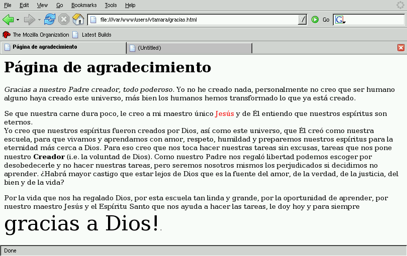

## Primeras páginas HTML {#primeras_paginas_html}

Las páginas web deben ubicarse en un directorio destinado para esto (el cual debe haber sido configurado por el administrador con ese propósito en el servidor web), generalmente es el subdirectorio ```public_html``` de su directorio personal (e.g /home/juan/public_html). Tal directorio y sus archivos deben tener permiso de lectura para todos, y el directorio debe tener permiso de ejecución para todos. Puede asegurarse de esto con:
```
$ cd ~
$ chmod -R a+r public_html
$ chmod a+x public_html
$ chmod a+x .```
La dirección (o URL) que se emplee para ver sus páginas desde un navegador depende de la forma como se haya configurado el servidor web (y eventualmente el DNS). Por ejemplo para ver el archivo ```objetivo.html``` después de que lo haya ubicado en el directorio apropiado del ```servidor, practica.pasosdeJesus.org``` podría ser una dirección como ```http://practica.pasosdeJesus.org/~juan/objetivo.html``` o ```http://practica.pasosdeJesus.org/juan/objetivo.html``` o si tiene un dominio ya configurado, algo como ```http://www.midominio.org/objetivo.html```.

Si desde un navegador emplea una dirección, pero sin especificar un nombre de archivo, el servidor buscará y presentará la información de un archivo por defecto. Tal archivo usualmente es ```index.html``` o ```index.php```. Así por ejemplo al emplear el URL ```http://practica.pasosdeJesus.org/~juan``` desde un navegador, se presentaría la misma información del URL: ```http://practica.pasosdeJesus.org/~juan/index.html```.

Para ubicar las páginas web en el directorio apropiado, puede bien transferirlas desde otro computador (ver [Sección 9, “Transferencia de información a y desde el servidor”](http://socrates.io/#QvlirQp))	o bien crearlas directamente en el servidor (por ejemplo con el editor **vim** que de configurarse apropiadamente le facilitará la edición de HTML --ver [Sección 7.3.3, “vim”](http://socrates.io/#9EwxGG8)).

Para elaborar su primera página HTML, puede basarse en la siguiente página que ejemplifica cómo cambiar estilo de letra, colores, tamaño, párrafos, cambios de línea y encabezados.
```
<html>
	<head>
    	<title>
			Página de agradecimiento
		</title>
    </head>

	<body bgcolor="#FFFFFF">
		<h1>Página de agradecimiento</h1>
		<i>Gracias a nuestro Padre Creador, Todo poderoso.</i>
		Yo no he creado nada, personalmente no creo que ser humano 
		alguno haya creado este universo, más bien los humanos 
		hemos transformado lo que ya está creado.
		<p>
		Se que nuestra carne dura poco, le creo a mi maestro único
		<font color="red">Jesús</font> y 
		de Él entiendo que nuestros espíritus son eternos.<br>
		Yo creo que nuestros espíritus fueron creados por Dios,
		así como este universo, que Él creó como nuestra escuela,
		para que vivamos y aprendamos con amor, respeto, humildad
		y preparemos nuestros espíritus para la eternidad más cerca a
		Dios. Para eso creo que nos toca hacer nuestras tareas sin
		excusas, tareas que nos pone nuestro <b>Creador</b> 
		(i.e. la voluntad de Dios).   Como nuestro Padre nos regaló 
		libertad podemos escoger por desobedecerle y no hacer nuestras 
		tareas, pero seremos nosotros mismos los perjudicados si 
		decidimos no aprender.  ¿Habrá mayor castigo que estar
		lejos de Dios que es la fuente del amor, de la verdad, de la
		justicia, del bien y de la vida?
		<p>
		Por la vida que nos ha regalado Dios, por esta
		escuela tan linda y grande, por la oportunidad de
		aprender, por nuestro maestro Jesús y el Espíritu
		Santo que nos ayuda a hacer las tareas, y por tantas
	       	otras maravillas le doy hoy
		y para siempre <font size="+4">gracias a Dios!</font>.
	</body>
</html>```
		
Al abrirla con un navegador se ve algo como:




### Lecturas recomendadas {#lecturas_recomendadas_html}

Puede aprender sobre HTML por ejemplo en: http://www.w3.org/MarkU
