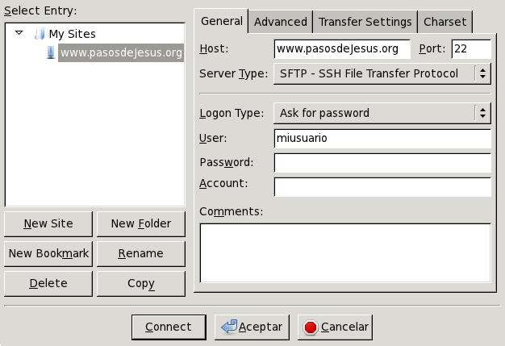
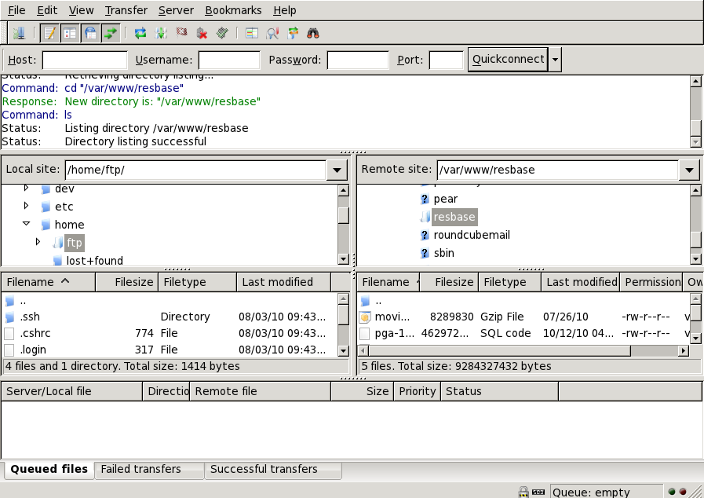

## Transferencia de información a y desde el servidor {#transferencia_de_informacion_a_y_desde_el_servidor}

Hay diversos métodos para transferir información entre el servidor y otros 
computadores, uno de los más seguros consiste en emplear una conexión cifrada 
como las ofrecidas por **ssh**. Para emplear este método desde el servidor 
OpenBSD (o otro sistema tipo Unix que cuente con OpenSSH) se puede usar 
bien **scp** desde la línea de comandos o el programa filezilla.

### Filezilla {#filezilla}

**filezilla** le permite transmitir archivos a un servidor.

Puede usarse sobre sistemas operativos OpenBSD, Linux, Mac OS X y Windows. 
Soporta los protocolo FTP, SFTP y FTP sobre SSL.

Una vez instalado ejecútelo y configure la primera vez la conexión a su 
servidor desde el menú Archivo->Gestor de Sitios. Del siguiente ejemplo 
adapte el nombre del servidor y de usuario.


              
Una vez configurada la encontrará al abrir FileZilla e ingresar a 
Archivos->Sitios. Cuando elija Conectar se iniciará una conexión encriptada, 
con un intercambio inicial de llaves que debe aceptar, después aparecerán 
paneles como los siguientes:


              
Note que al lado izquierdo están las carpetas y archivos de su computador 
local, mientras que al lado derecho están las carpetas y archivos del servidor. 
Para transmitir un archivo de uno a otro basta que lo arrastre.

### Uso básico de scp {#uso_basico_de_scp}

Si por ejemplo desea transferir el archivo ```ideas.txt``` del servidor 
OpenBSD ```practica.pasosdeJesus.org``` a otro servidor tipo Unix que tenga 
instalado y configurado ssh (digamos ```comp.trabajo.net```), a la cuenta de 
un usuario ```mateo```, en el directorio ```personal```:

```
$ scp ideas.txt mateo@comp.trabajo.net:personal
```
		
Si desea transmitir el archivo metodo.txt del directorio personal del 
servidor ```comp.trabajo.net``` al directorio en el que está ubicado en 
```practica.pasosdeJesus.org```:

```sh
$ scp juan2@comp.trabajo.net:personal/metodo.txt .
```
		
Note que **scp** es similar a **cp** (pues permite copiar un archivo fuente en 
uno destino[^transferencia.1]) sólo que el archivo fuente o el archivo destino 
pueden estar en otra máquina.

[^transferencia.1]: Incluso scp implementa la funcionalidad de cp al permitir 
	copiar localmente un archivo.

Dado que Windows no tiene un servidor **ssh** por defecto, es posible 
transmitir archivos a y desde sistemas Windows sólo desde el computador con 
Windows usando un programa como **winscp** (disponible en <http://winscp.sf.net> 
o **pscp** que se distribuye junto con **putty** ([xref](#conceptos_basicos)).

### Lecturas recomendadas {#lecturas_recomendadas_transferencia}

Para aprender más sobre ```scp``` recomendamos la página del manual.
